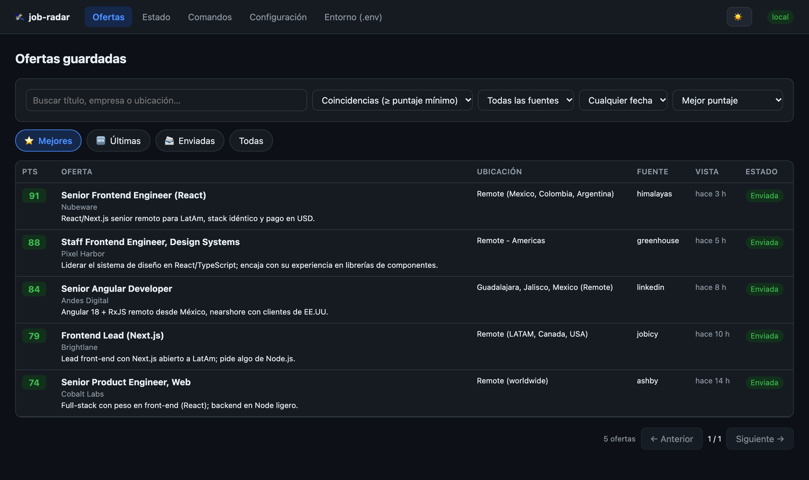
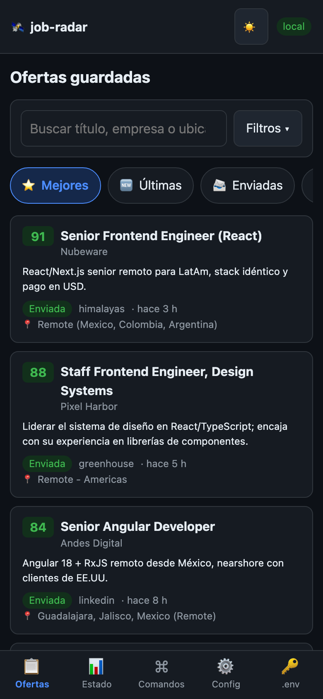
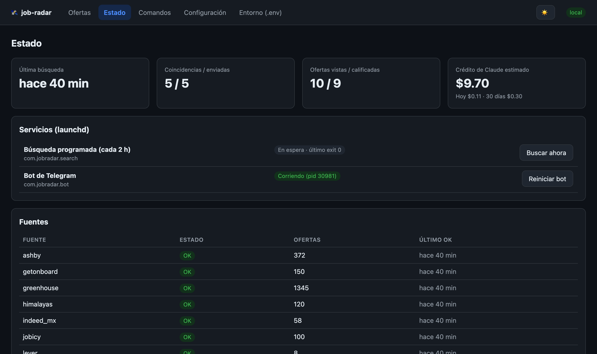
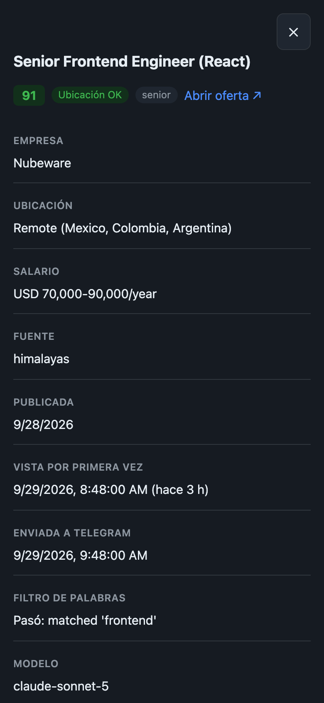

# 🛰️ job-radar

Tu radar personal de empleo. Cada 2 horas busca ofertas nuevas en varias bolsas de trabajo, las **califica con
Claude (IA) contra tu perfil** y te manda por **Telegram** solo las que valen la pena. Incluye un bot para
consultarlo desde el celular y un portal web local para ver todas las ofertas guardadas.

**Solo busca y ordena ofertas.** Nunca se postula por ti, nunca inicia sesión en LinkedIn ni en ningún sitio y
nunca publica nada.

| Escritorio | Celular |
|---|---|
|  |  |
|  |  |

<sub>Capturas con datos ficticios.</sub>

## Qué hace

```
fuentes ─► normaliza ─► quita duplicados (SQLite) ─► filtro de palabras ─► Claude califica (solo nuevas) ─► Telegram
```

- **14 fuentes:** Indeed, LinkedIn (búsqueda pública), APIs de Greenhouse/Lever/Ashby para las empresas que tú
  elijas, Remotive, Remote OK, Get on Board, Himalayas, Jobicy, Working Nomads y (opcional) Computrabajo.
- **Calificación con Claude:** puntaje 0–100, si la ubicación o la modalidad te sirve, seniority, una línea de por
  qué y alertas (ej. "requiere autorización de trabajo en EE.UU."). Cada oferta se califica **una sola vez**.
- **Resumen por Telegram** con las ofertas de 70+ puntos, solo en tu horario (7:00–22:00 por defecto). Lo que se
  encuentra de noche llega en el resumen de las 7:00.
- **Bot de Telegram:** `/ultimos`, `/top`, `/hoy`, `/estado`, `/credito`, `/skills`, `/buscar`…
- **Reporte de skills:** qué tecnologías piden más las ofertas cercanas a tu perfil y cuáles te abrirían más
  ofertas (ej. "full stack, ¿especializado en qué backend?").
- **Portal web local** (opcional): ver y filtrar todas las ofertas, el estado, ejecutar comandos y editar la
  configuración. Se puede usar desde el celular (acceso remoto con login de Google: ver ofertas,
  correr comandos y marcar postulaciones, pero no editar la configuración) e instalar
  como app en el iPhone.
- **Control de costo:** estima tu saldo de Claude y te avisa cuando se está acabando.

### ¿Por qué Telegram y no WhatsApp?

WhatsApp no tiene bots gratuitos como Telegram. La única vía oficial es la API de negocios de Meta (WhatsApp Cloud
API), y no la usamos porque:

- **Cuesta:** los mensajes que envía el sistema por su cuenta (como el resumen de las 7:00) tienen que ser
  plantillas aprobadas por Meta y se cobran por mensaje. Solo es gratis responder dentro de las 24 horas después
  de que tú escribas.
- **Es difícil de implementar:** requiere cuenta de desarrollador y de negocio en Meta, un número dedicado,
  aprobar plantillas y un webhook público para recibir comandos.

Las alternativas no oficiales (conectarse como si fuera WhatsApp Web) van contra los términos de WhatsApp y pueden
hacer que bloqueen tu número. Telegram es gratis, sin plantillas ni ventanas de 24 horas, y sus bots son oficiales.

## Requisitos

> **¿Windows o Linux, o quieres tenerlo encendido 24/7 en un servidor?** Usa la versión con
> [Docker](#docker-windows-linux-o-servidor). Lo de abajo es la instalación nativa para Mac.

| Necesitas | Para qué | Notas |
|---|---|---|
| **Mac** (Apple Silicon o Intel) | Corre los servicios en segundo plano (launchd) | Sesión iniciada; ver [Mantener la Mac despierta](#mantener-la-mac-despierta) |
| **Python 3.10–3.12** o [uv](https://docs.astral.sh/uv/) | El programa principal | JobSpy no funciona con 3.13+. Con `uv` instalado, el script consigue Python 3.12 solo |
| **Cuenta de Anthropic con crédito** | Calificar ofertas con Claude | [console.anthropic.com](https://console.anthropic.com). ~US$4–7 al mes con el modelo por defecto |
| **Telegram** | Recibir los resúmenes y usar el bot | Gratis. Crearás un bot propio |
| Node.js ≥ 22.5 *(opcional)* | El portal web | `node --version` para revisar |
| Cuenta de ngrok *(opcional)* | Abrir el portal desde el celular fuera de casa | Plan gratuito |

## Instalación

> Clona el repo **fuera** de `~/Documents`, `~/Desktop`, `~/Downloads` e iCloud Drive: la protección de privacidad
> de macOS no deja que los servicios en segundo plano lean esas carpetas.

**1. Clona el repo**

```bash
cd ~
git clone https://github.com/santiagoalberto416/job-radar-public.git job-radar
cd job-radar
```

**2. Instala las dependencias** (crea `.venv`, instala paquetes y crea `.env`; todavía no activa nada)

```bash
scripts/install_mac.sh --deps-only
```

**3. Describe tu perfil.** Claude lo usa para calificar cada oferta: entre más claro digas qué quieres y qué
**no**, mejor califica.

```bash
cp profile.example.md profile.md
open -e profile.md
```

**4. Crea tu configuración**

```bash
cp config.example.yaml config.yaml
open -e config.yaml
```

Lo mínimo que tienes que revisar:

- **`location`:** dónde vives, en qué países/regiones aceptas remoto y en qué ciudades aceptas presencial.
- **`exclude_companies`:** tu empleador actual si tu búsqueda es confidencial.
- **`prefilter`:** las palabras de títulos que te interesan y las que no (el ejemplo es para front-end).
  `location_local` son tus ciudades.
- **`sources`:** los términos de búsqueda y ciudades de Indeed/LinkedIn, las empresas de Greenhouse/Lever/Ashby,
  el país de Himalayas (`country: MX`) y las regiones de Jobicy. Ver [Adaptarlo a otro país o perfil](#adaptarlo-a-otro-país-o-perfil).

**5. Clave de Claude.** En [console.anthropic.com](https://console.anthropic.com) → **API Keys** crea una clave y
compra crédito (US$5 alcanzan para empezar). Ponla en `.env`:

```
ANTHROPIC_API_KEY=sk-ant-...
```

**6. Tu bot de Telegram**

1. En Telegram abre **@BotFather**, envía `/newbot`, elige un nombre y un usuario (debe terminar en `bot`).
2. Copia el **token** que te da y ponlo en `.env` como `TELEGRAM_BOT_TOKEN=...`
3. Abre tu bot (el enlace `t.me/<usuario_del_bot>`), toca **Iniciar** y envíale cualquier mensaje ("hola").
4. Obtén tu chat_id y ponlo en `.env` como `TELEGRAM_CHAT_ID=...`:

   ```bash
   .venv/bin/python -m job_radar telegram-setup
   ```
5. Pruébalo:

   ```bash
   .venv/bin/python -m job_radar test-telegram
   ```

Usa un bot **solo para job-radar**: si otra app lee los mensajes del mismo bot, `telegram-setup` no encuentra nada.

**7. Pruébalo a mano**

```bash
.venv/bin/python -m job_radar check-sources               # consulta cada fuente (no guarda nada)
.venv/bin/python -m job_radar run --dry-run --max-llm 5   # corrida completa; imprime en vez de enviar
```

**8. Activa los servicios en segundo plano** (la búsqueda cada 2 horas y el bot de Telegram)

```bash
scripts/install_mac.sh
```

Si falta algo (config, perfil o claves), el script te dice qué y no activa nada. Desde aquí job-radar trabaja
solo: la primera corrida es inmediata y luego cada 2 horas.

**9. (Opcional) El portal web:** ver [portal/README.md](portal/README.md).

```bash
portal/scripts/install_portal.sh      # queda en http://127.0.0.1:4747
```

## Docker (Windows, Linux o servidor)

La misma aplicación empaquetada en Docker: funciona en **Windows, Linux y Mac**, y en un **servidor o VPS
encendido 24/7** (así no dependes de que tu computadora esté despierta). Corre tres servicios: `search` (la búsqueda
en el mismo horario: al arrancar, cada 2 horas y a las 7:00), `bot` (el bot de Telegram) y `portal`
(en http://127.0.0.1:4747, solo accesible desde esa máquina).

**Requisitos:** [Docker Desktop](https://www.docker.com/products/docker-desktop/) (Windows/Mac) o Docker Engine con
Compose (Linux), cuenta de Anthropic con crédito y Telegram. No necesitas instalar Python ni Node.

```bash
git clone https://github.com/santiagoalberto416/job-radar-public.git job-radar
cd job-radar
cp config.example.yaml config.yaml      # en Windows (PowerShell): copy config.example.yaml config.yaml
cp profile.example.md profile.md
cp .env.example .env
```

1. Edita `profile.md`, `config.yaml` y `.env` igual que en los pasos 3 a 6 de la [instalación](#instalación). En
   `.env` descomenta `TZ=` y pon tu zona horaria (ej. `America/Bogota`); por defecto es `America/Mexico_City`.
2. Tu chat_id de Telegram (después de escribirle a tu bot):

   ```bash
   docker compose run --rm search python -m job_radar telegram-setup
   docker compose run --rm search python -m job_radar test-telegram
   ```
3. Prueba y arranca:

   ```bash
   docker compose run --rm search python -m job_radar run --dry-run --max-llm 5
   docker compose up -d --build
   ```

| Tarea | Comando |
|---|---|
| Ver logs | `docker compose logs -f search` (o `bot`, `portal`); también quedan en la carpeta `logs/` |
| Cualquier comando de la CLI | `docker compose run --rm search python -m job_radar <comando>` |
| Buscar ahora | Portal → Estado → *Buscar ahora*, o `/buscar` en Telegram |
| Reiniciar el bot (tras cambiar `.env`) | `docker compose restart bot` |
| Actualizar a una versión nueva | `git pull && docker compose up -d --build` |
| Detener todo | `docker compose down` (tus datos se conservan) |
| Respaldar la base de datos | `docker compose cp search:/data/data/jobs.db ./jobs-backup.db` |

**Acceso remoto (opcional):** llena `NGROK_AUTHTOKEN`, `NGROK_DOMAIN` y `NGROK_ALLOWED_EMAILS` en `.env` (ver
[portal/README.md](portal/README.md)) y arranca con `docker compose --profile remote up -d --build`. El túnel no
arranca si no hay correos autorizados, y por el túnel no se pueden editar `.env`, la configuración ni el perfil.

Notas:

- Tus archivos (`config.yaml`, `profile.md`, `.env`, `logs/`) se leen de la carpeta del repo, así que puedes
  editarlos directamente o desde el portal. La base de datos vive en un volumen de Docker (`jobs-data`), que es
  más confiable para SQLite cuando varios contenedores la usan.
- En una laptop, Docker también se detiene cuando la computadora se duerme; al despertar corre la búsqueda
  pendiente. Para 24/7, úsalo en un servidor.
- Si ya tenías la instalación nativa de Mac, no corras ambas a la vez: detén la nativa con `scripts/uninstall_mac.sh`.

## Uso diario

### Bot de Telegram

Escríbele a tu bot (toca **/** para ver el menú; la barra es opcional). Solo responde a tu chat.

| Comando | Qué responde |
|---|---|
| `/ultimos [n]` | Las últimas n coincidencias (≥ `min_score` y ubicación OK). 5 por defecto |
| `/recientes [n]` | Las últimas n ofertas evaluadas, cualquier puntaje (✓/✗ = ubicación) |
| `/top [días]` | Las mejores de los últimos N días (7 por defecto) |
| `/hoy` | Resumen de hoy: vistas, filtradas, calificadas, enviadas, gasto de Claude |
| `/estado` | Estado de cada fuente, próxima búsqueda, ofertas esperando el horario |
| `/credito` | Crédito de Claude estimado |
| `/postulaciones` | Ofertas a las que aplicaste, con botones para marcar 🗣 entrevista, 🎉 oferta o ✖ rechazo |
| `/semana` | Resumen de los últimos 7 días (también llega solo los lunes a las 7:00) |
| `/filtro [días]` | Títulos que el filtro de palabras quizá está descartando por error |
| `/reactivar <fuente>` | Reactiva una fuente que se desactivó por fallar muchas veces |
| `/skills [días]` | Reporte de skills con recomendación de Claude (~US$0.015) |
| `/buscar` | Buscar ahora (las fuentes consultadas hace poco se saltan) |
| `/ayuda` | La lista de comandos |

### Tu opinión y tus postulaciones

Cada oferta del resumen trae botones: **👍** te interesa, **👎** no, **📨** ya aplicaste. Luego, en `/postulaciones`,
marcas cómo va cada una (🗣 entrevista, 🎉 oferta, ✖ rechazo). En el portal puedes hacer lo mismo y agregar notas
(contacto, fechas, salario ofrecido), y la vista **🗂️ Postulaciones** junta todo.

Tus 👍, 👎 y postulaciones también **mejoran la calificación**: las más recientes se le pasan a Claude como ejemplos
de lo que te gusta y lo que no (`llm.use_feedback`, activado por defecto).

### Línea de comandos

Desde la carpeta del repo: `.venv/bin/python -m job_radar <comando>`

| Comando | Qué hace |
|---|---|
| `run` | Consulta las fuentes que tocan, califica las nuevas y envía el resumen |
| `run --dry-run` | Igual, pero imprime el resumen en vez de enviarlo (sí guarda y califica) |
| `run --no-llm` | Sin calificar con Claude |
| `run --force` | Consulta todas las fuentes aunque no les toque todavía |
| `run --max-llm N` | Califica máximo N ofertas en esta corrida |
| `check-sources [fuentes...]` | Consulta cada fuente en vivo y muestra cuántas ofertas trae. No guarda nada |
| `top --days 7` | Las mejores ofertas de la base de datos |
| `skills [--days N] [--send] [--no-llm]` | Reporte de skills; `--send` lo manda a Telegram |
| `credit [--send]` | Gasto de Claude y saldo estimado; `--send` lo manda a Telegram |
| `weekly [--send]` | Resumen de los últimos 7 días; `--send` lo manda a Telegram |
| `filter-report [--days N] [--send]` | Títulos que el filtro de palabras quizá descarta por error, y exclusiones que chocan con tus palabras |
| `source-enable <fuente>` | Reactiva una fuente desactivada automáticamente |
| `telegram-setup` | Muestra tu chat_id después de escribirle al bot |
| `test-telegram` | Envía un mensaje de prueba |
| `bot` | Corre el bot de Telegram en primer plano (normalmente lo hace el servicio) |

## Personalizar

Todo está en `config.yaml` (comentado en español). Los cambios aplican desde la siguiente corrida, sin reinstalar.
Para el bot, reinícialo después de cambiar `.env`.

- **`min_score`** (70): puntaje mínimo para enviarte una oferta. **`require_location_fit`**: exige además que la
  ubicación te sirva.
- **`notify_window`**: horario de mensajes (7:00–22:00, inclusivo). Bórralo para recibir a cualquier hora.
- **`llm`**: modelo, esfuerzo y tope de ofertas por corrida (control de costo).
- **`prefilter`**: filtro por palabras antes de Claude (así no pagas por ofertas obviamente fuera). Un título pasa si
  tiene una palabra de `title_include`, o una de `title_include_if_senior` más una de `senior_keywords`, y ninguna
  de `title_exclude`. Presencial/híbrido solo pasa en `location_local`.
- **`sources.<fuente>.min_interval_hours`**: cada cuánto se consulta cada fuente (respeta los límites de cada
  sitio). `enabled: false` la apaga.
- **`skills_report.not_really_have`**: skills de tu perfil que no quieres que cuenten como "ya lo tienes".
- **`health`**: si una fuente falla 6 veces seguidas se desactiva y te avisa; se reintenta cada 24 h y vuelve sola.
  El bot también te avisa si no ha terminado una búsqueda correcta en 6 horas. Con `ping_url` (ej. un check gratis
  de [healthchecks.io](https://healthchecks.io)) te llega un correo aunque la computadora esté apagada.
- **`salary`**: salario mínimo en USD al mes (`min_usd_month`). Los salarios se normalizan a USD/mes (con
  `fx_per_usd` para MXN y otras monedas) y se muestran en Telegram y el portal. Solo se descartan las ofertas que
  **claramente** pagan menos (el máximo del rango); las que no dicen salario, o lo dicen de forma ambigua, pasan. Si
  el salario solo viene en la descripción, Claude lo extrae.
- **`closed_check`**: antes de enviarte una oferta se revisa que siga abierta (404, "No longer accepting
  applications", etc.). Si el sitio no responde claro, se envía igual.
- **`backup`**: copia semanal de la base de datos en `data/backups/` (guarda las últimas 4).
- **`weekly_summary`**: resumen semanal por Telegram (lunes 7:00 por defecto).

Revisa el efecto con `check-sources` (muestra cuántas ofertas pasan el filtro por fuente), y usa `/filtro` o
`filter-report` para ver qué títulos de desarrollo está descartando y si alguna exclusión choca con tus palabras
(por ejemplo, `.net` descartando "Full Stack (.NET / Angular)").

### Adaptarlo a otro país o perfil

- **Ubicación:** `location.home`, `remote_ok` y `onsite_ok` (lo que lee Claude) y `prefilter.location_local` /
  `location_remote_allow` / `location_exclude` (el filtro de palabras). Si tu país está en `location_exclude`,
  quítalo.
- **Indeed:** `indeed_mx` usa `country: mexico`; cambia a tu país (ej. `colombia`, `argentina`, `spain`).
- **LinkedIn:** cambia `searches` (términos y `location`).
- **Himalayas:** `country` con el código ISO de tu país (`CO`, `AR`, `CL`, `ES`…).
- **Jobicy:** `geos` (ej. `latam`, `colombia`, `argentina`).
- **Get on Board** es de LatAm; **Remotive** y **Remote OK** son globales.
- **Otro rol** (backend, datos, móvil…): ajusta `prefilter.title_include` / `title_exclude` y describe el rol en
  `profile.md`. La calificación sigue a tu perfil.

### Agregar empresas (Greenhouse, Lever, Ashby)

Abre la página de empleos de la empresa, entra a cualquier oferta y mira la URL:

| La URL se ve así | ATS | Token | Agrégalo en |
|---|---|---|---|
| `boards.greenhouse.io/acme/...` o `...?gh_jid=123` | Greenhouse | `acme` | `sources.greenhouse.companies` |
| `jobs.lever.co/acme/...` | Lever | `acme` | `sources.lever.companies` |
| `jobs.ashbyhq.com/acme/...` | Ashby | `acme` | `sources.ashby.companies` |

Verifica que responda 200 antes de agregarla:

```bash
curl -s -o /dev/null -w "%{http_code}\n" https://boards-api.greenhouse.io/v1/boards/acme/jobs
curl -s -o /dev/null -w "%{http_code}\n" "https://api.lever.co/v0/postings/acme?mode=json"
curl -s -o /dev/null -w "%{http_code}\n" https://api.ashbyhq.com/posting-api/job-board/acme
```

### Elegir el modelo (costo)

`llm.model` en `config.yaml`. Costos medidos con ofertas reales (~2.9k tokens de entrada por oferta, casi todo el
perfil en caché, y ~130 de salida):

| Modelo | Por oferta | Al mes (aprox.)* | Notas |
|---|---|---|---|
| `claude-sonnet-5` (**por defecto**) | ~US$0.0045 | ~US$4–7 | Calificó igual que Opus en pruebas |
| `claude-opus-5` | ~US$0.0085 | ~US$8–15 | El más cuidadoso |
| `claude-haiku-4-5` | ~US$0.0025 | ~US$2–3 | Sobrecalificó roles full-stack con mucho backend |

**Batch API (50% más barato):** con `llm.batch: true` las ofertas se califican en lote a mitad de precio. La
calificación deja de ser instantánea: cada corrida espera el lote hasta `batch_wait_minutes` (10) y, si tarda más,
esas ofertas llegan en la siguiente corrida.

\* Suponiendo que 20–40 ofertas al día pasan el filtro. La primera corrida califica un rezago (30–40 ofertas,
~US$0.15). Cada corrida registra su costo real en el log. El tope es `max_jobs_per_run` × 12 corridas al día.

### Crédito de Claude

Anthropic no tiene una API para consultar el saldo de una cuenta individual, así que job-radar lo **estima**:
anota en `config.yaml` el saldo que ves en **Console → Settings → Billing** y cuándo lo viste; job-radar le resta
lo que gasta.

```yaml
credit:
  balance_usd: 10.00
  as_of: "2026-10-01 09:30"   # hora local; una fecha sola cuenta desde la medianoche
```

Recibes un mensaje al día con el gasto de ayer, de 30 días y el saldo estimado; se vuelve advertencia debajo de
`warn_below_usd`. Si la API avisa que se acabó el crédito, te llega una alerta inmediata (y las búsquedas siguen;
se califica al recargar). Actualiza ambos valores cada vez que recargues.

## Fuentes y términos de uso

| Fuente | Cómo se consulta | En el ejemplo | Notas |
|---|---|---|---|
| Greenhouse, Lever, Ashby | API pública por empresa | ✅ | Cada 6 h |
| Remotive | API pública | ✅ | Máx. ~4 consultas al día (sus términos) |
| Remote OK | API pública | ✅ | Pide enlazar y citar la fuente |
| Get on Board | API pública | ✅ | LatAm |
| Himalayas | API pública | ✅ | Cada 24 h; filtra por país |
| Jobicy | API pública | ✅ | Máx. 1 consulta por hora; filtra por región |
| Working Nomads | API pública | ✅ | Las ~60 más nuevas; solo la categoría Development |
| Indeed, LinkedIn | Páginas públicas vía [JobSpy](https://github.com/speedyapply/JobSpy), sin login | ✅ | ⚠️ Sus términos no permiten acceso automatizado |
| Google Jobs | JobSpy | ❌ | No devolvía resultados al probarlo |
| Computrabajo | Páginas públicas con encabezados de navegador | ❌ | ⚠️ Su aviso legal lo prohíbe y bloquea bots |

Las fuentes marcadas con ⚠️ se usan **bajo tu responsabilidad**: job-radar las consulta despacio y sin iniciar
sesión, pero pueden bloquear tu IP. Si no quieres ese riesgo, pon `enabled: false`. El resumen de Telegram
siempre enlaza a la oferta original y nombra la fuente.

## Mantener la Mac despierta

Los servicios solo corren con la Mac **encendida, despierta y con tu sesión iniciada** (la pantalla bloqueada está
bien). Si la Mac duerme, la búsqueda pendiente corre una vez al despertar.

Para que corra a tiempo con la pantalla apagada: conéctala a la corriente, deja la tapa abierta y activa
**Configuración del Sistema → Batería → Opciones → Evitar el reposo automático con el adaptador de corriente cuando
la pantalla esté apagada**. Cada corrida usa `caffeinate -i`, así que la Mac no se duerme a la mitad de una búsqueda.

## Logs, estado y desinstalar

```bash
tail -f ~/Library/Logs/job-radar.log                    # búsquedas (una línea por fuente, calificación y resumen)
grep "run done" ~/Library/Logs/job-radar.log | tail     # una línea por corrida, con su costo
tail -f ~/Library/Logs/job-radar-bot.log                # bot de Telegram
launchctl kickstart gui/$(id -u)/com.jobradar.search    # buscar ahora
scripts/uninstall_mac.sh                                # detiene y quita los servicios (conserva datos, .env y logs)
```

Los servicios se llaman `com.jobradar.search` y `com.jobradar.bot` (el portal y el túnel, `com.jobradar.portal` y
`com.jobradar.tunnel`). Para otro prefijo usa la variable `JOB_RADAR_LABEL_PREFIX` al instalar y desinstalar.

La base de datos es `data/jobs.db` (SQLite). Cada oferta vista se guarda con su filtro y su puntaje, así que nada se
califica ni se envía dos veces. Si todas las fuentes fallan en una corrida te llega un aviso por Telegram.

## Solución de problemas

| Problema | Solución |
|---|---|
| `install_mac.sh` falla con numpy o "incompatible architecture" | Tienes el Homebrew de Intel en una Mac Apple Silicon. Instala [uv](https://docs.astral.sh/uv/), borra `.venv` y vuelve a correr el script |
| Los servicios no leen el repo ("Operation not permitted") | El repo está en Documents/Desktop/Downloads/iCloud. Muévelo (ej. a `~/job-radar`) y reinstala |
| `telegram-setup` no encuentra mensajes | Escríbele al bot primero. Si el servicio del bot ya corre, él lee los mensajes: detenlo con `launchctl bootout gui/$(id -u)/com.jobradar.bot` y reintenta |
| Telegram responde `401 Unauthorized` | El token está mal copiado o se revocó. Cópialo de nuevo en @BotFather → `/mybots` → API Token |
| Docker: el portal no abre | Revisa `docker compose ps` y `docker compose logs portal`. El puerto se publica solo en 127.0.0.1 (cámbialo con `PORTAL_PORT` en `.env`) |
| Docker: la hora de los mensajes está corrida | Pon tu zona horaria en `TZ=` en `.env` y reinicia: `docker compose up -d` |
| No llegan ofertas | Revisa `/estado` y `/hoy` en el bot: puede ser que ninguna pase de `min_score`, que estés fuera de `notify_window` o que una fuente falle |
| "credit balance is too low" | Recarga crédito en console.anthropic.com y actualiza `credit` en `config.yaml` |
| Una fuente falla siempre (403, bloqueo) | Desactívala con `enabled: false`; las demás siguen funcionando |

## Privacidad

Todo corre en tu Mac: la base de datos, el perfil y las claves nunca salen de ella, salvo lo necesario para
funcionar. Claude recibe tu perfil y el texto de cada oferta para calificarla, y Telegram recibe los resúmenes que
te envía tu propio bot. `config.yaml`, `profile.md`, `.env` y `data/` están en `.gitignore`.

## Desarrollo

```bash
.venv/bin/python -m pytest -q          # 128 tests; usan config.example.yaml y profile.example.md
cd portal && npm test                  # tests del API del portal
```

Los tests de las fuentes usan respuestas reales grabadas en `tests/fixtures/` y los del calificador simulan la API
de Claude; ninguno usa la red. GitHub Actions los corre en cada push (`.github/workflows/tests.yml`).

**Dependencias:** `requirements.txt` dice qué se necesita y `requirements.lock` fija las versiones exactas probadas
(es lo que instala `install_mac.sh`). Para actualizarlas:

```bash
uv pip compile requirements.txt --universal --python-version 3.10 -o requirements.lock
.venv/bin/python -m pytest -q
```

## Licencia

[MIT](LICENSE).
